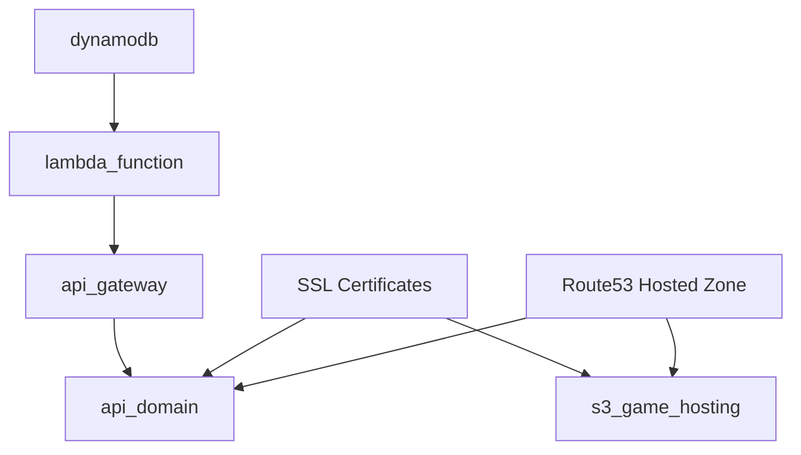

# Cloud Defenders Infrastructure Modules

This directory contains modular Terraform configurations for the Cloud Defenders game infrastructure. Each module has a single responsibility and can be used independently or composed together.

## Module Structure

### Core Modules

#### 1. **dynamodb** 
- **Purpose**: Manages the DynamoDB table for storing game scores
- **Resources**: DynamoDB table with GSI for leaderboard queries
- **Outputs**: Table name and ARN

#### 2. **lambda_function**
- **Purpose**: Manages the Lambda function and its IAM roles
- **Resources**: Lambda function, IAM roles, policies, CloudWatch logs
- **Dependencies**: Requires DynamoDB table ARN for permissions
- **Outputs**: Function name, ARN, and invoke ARN

#### 3. **api_gateway**
- **Purpose**: Manages the API Gateway REST API configuration
- **Resources**: REST API, resources, methods, integrations, CORS, deployment
- **Dependencies**: Requires Lambda function details for integration
- **Outputs**: API ID, execution ARN, stage name, and URL

#### 4. **api_domain**
- **Purpose**: Manages custom domain configuration for API Gateway
- **Resources**: Custom domain, base path mapping, Route53 records
- **Dependencies**: Requires API Gateway details and SSL certificate
- **Outputs**: Domain names and custom URL

#### 5. **s3_game_hosting**
- **Purpose**: Manages S3 bucket and CloudFront for static website hosting
- **Resources**: S3 bucket, CloudFront distribution, custom domain, Route53 records
- **Outputs**: Bucket name, CloudFront details, website URL

## Module Dependencies



## Benefits of Modular Structure

### 1. **Single Responsibility**
- Each module has one clear purpose
- Easier to understand and maintain
- Reduced complexity per module

### 2. **Reusability**
- Modules can be reused across different environments
- Easy to compose different combinations
- Standardised patterns across projects

### 3. **Testing**
- Each module can be tested independently
- Easier to isolate issues
- Faster development cycles

### 4. **Maintainability**
- Changes to one component don't affect others
- Clear boundaries between concerns
- Easier to update individual components

### 5. **Team Collaboration**
- Different team members can work on different modules
- Clear ownership boundaries
- Reduced merge conflicts

## Usage Example

```hcl
# Use individual modules
module "dynamodb" {
  source = "./modules/dynamodb"
  
  project_name = "my-game"
  environment  = "prod"
}

module "lambda_function" {
  source = "./modules/lambda_function"
  
  project_name         = "my-game"
  environment          = "prod"
  dynamodb_table_name  = module.dynamodb.table_name
  dynamodb_table_arn   = module.dynamodb.table_arn
}

# Continue with other modules...
```

## Module Standards

### File Structure
Each module follows this standard structure:
```
module_name/
├── main.tf      # Main resources
├── variables.tf # Input variables
├── outputs.tf   # Output values
└── README.md    # Module documentation (optional)
```

### Naming Conventions
- **Resources**: Use descriptive names with project/environment prefixes
- **Variables**: Use snake_case with clear descriptions
- **Outputs**: Provide meaningful names and descriptions
- **Tags**: Include Name, Project, and Environment tags

### Best Practices
- Use data sources for external references
- Include proper dependencies with `depends_on`
- Use lifecycle rules where appropriate
- Provide comprehensive outputs for module composition
- Include validation for critical variables

## Migration from Monolithic Module

The previous `lambda_api` module has been split into:
- `dynamodb` - Database layer
- `lambda_function` - Compute layer  
- `api_gateway` - API layer
- `api_domain` - Domain/DNS layer

This provides better separation of concerns and makes the infrastructure more maintainable.